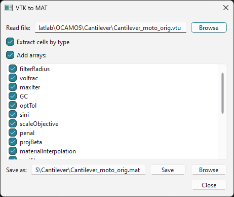
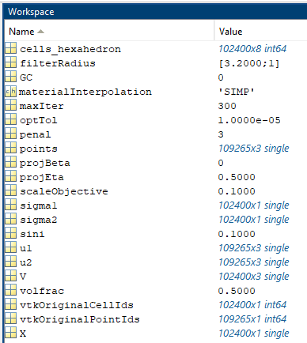

vtkmat
######

This package was created to quickly extract geometry information and associated data arrays from VTK files for the use in MATLAB through a simple GUI.

h to the .mat file to be saved, followed by two buttons "Save" and "Browse". At the bottom right corner is "Close" button.

    Fig. 1: GUI of the app showing loaded file.

    Fig. 2: Workspace in MATLAB showing variables after loading previously saved file.

The package has been tested under the following operating systems:
* Windows 11
* Ubuntu 22.04.4 LTS

Features
********

* Extract data from VTK file and save as .mat file
* Choose to store cell connectivity directly
* Select data arrays to write

Installation and usage
**********************

The package can be installed from root of the package directory using ``pip``:

.. code-block:: 
    
    python -m pip install .

The app itself is started using

.. code-block::

    python -m vtkmat

After launching the app, the GUI shown in fig. 1 appears empty. Select a VTK file via the "Read file" dialog. Per default, the checkbox "Extract cells by type" is activated. The idea is to write out the connectivity per `VTK CELL_TYPE <https://github.com/Kitware/vtk-examples/blob/gh-pages/src/Testing/Baseline/Cxx/GeometricObjects/TestLinearCellDemo.png?raw=true>`_ in a MATLAB array for ease of use. This option is valid for all cell types having a fixed number of points per cell. The resulting arrays are named, e.g., ``cells_tetra`` corresponding to the VTK cell names. This option is not available for cell types where the number of points per cell varies (e.g., ``POLY_LINE``). In this case, the checkbox must be deactivated to write out the content of the VTK data arrays ``celltypes``, ``connectivity`` and ``offsets`` directly.

The user may select or deselect arrays from the vtk file that should be written to the .mat file. Per default, all arrays are checked. Clicking the "Add arrays" checkbox deselects or selects all arrays at once.

The output file is named exactly as the input file and placed at the same directory per default. When the user selects a different location or filename using the "Browse"-dialog, the .mat-file is saved directly when pressing the "Save" button in the file browser.

* Tested VTK file formats: ``.vtk``, ``.vtu``, ``.vtp``
* Tested cell types for direct connectivity extraction: ``VERTEX``, ``TETRA``, ``HEXAHEDRON``, ``WEDGE``, ``PYRAMID``

Console mode
************

The package contains the module ``vtkfile`` where the functionality to read the VTK file and write the .mat-file is implemented. This module can be called directly without starting the GUI:

.. code-block::

    python -m vtkmat.vtkfile "path/to/file.vtk" "arg1" "arg2" "argN"

* First argument: Path to VTK file
* Optional arguments: Names of arrays to write, default: all

The output file ``path/to/file.mat`` will be named as the input file and is placed in the same directory.